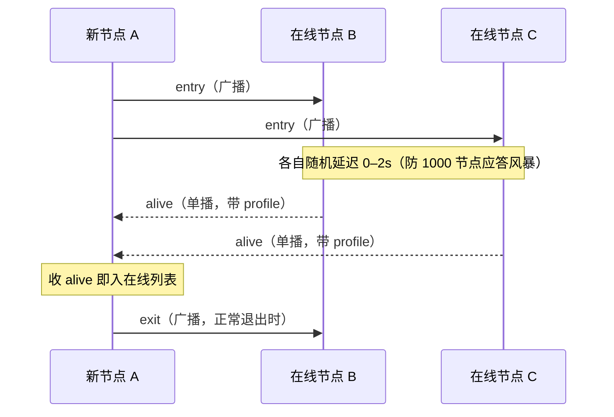
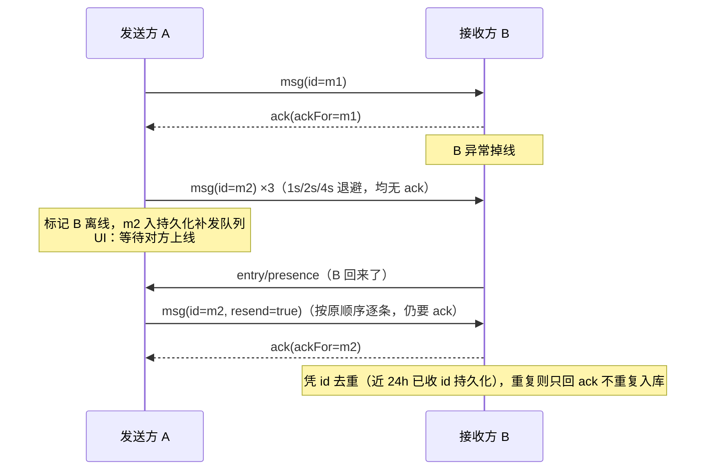
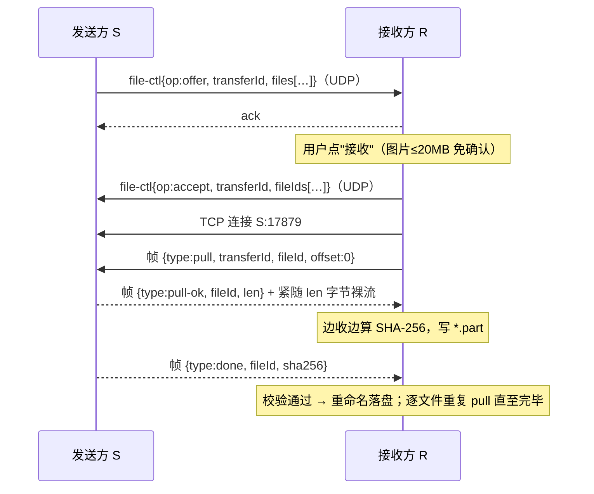

# 茶话间（Pantry）协议设计文档

| | |
|---|---|
| 状态 | v0.2，**基线已定**（决议见第 11 节）；心跳/重试等时延参数实现期按实测微调 |
| 日期 | 2026-06-10 |
| 关系 | 本文是**线上协议的唯一事实来源**；功能取舍依据 [requirements.md](requirements.md)（决议 #5：借鉴 ipmsg/iptux 机制、报文自有、不互通、不加密） |

## 1. 设计原则

1. **机制照搬成熟做法**：UDP 广播发现、UDP+ACK 可靠消息、TCP 拉取式文件传输——与 ipmsg/iptux 同构，实现时可对照 `references/ipmsg/protocol.txt` 与 `references/iptux/src`。
2. **报文自有**：UTF-8 JSON，永不引入 GBK/SJIS；不与 IPMSG 线上互通。
3. **对等无服务器**：任何节点崩溃/离线不影响其余节点；协议必须容忍丢包、乱序、重复、节点随时消失。
4. **可演进**：信封带版本号；收到未知 `type` 或未知字段一律忽略不报错（向前兼容的基础）。
5. **内网信任模型**：不加密、不签名（决议 #5），但**所有入站报文按不可信输入做校验**（长度、类型、字段白名单）。
6. v1 仅 IPv4，IPv6 远期（决议 #3）。

## 2. 传输层总览

| 通道 | 传输 | 默认端口 | 承载 |
|---|---|---|---|
| 控制/消息 | UDP（广播 + 单播） | 17878 | 发现、心跳、资料、gossip、短消息、ACK、文件控制 |
| 数据 | TCP | 17879 | 文件/图片字节流、长消息、批量补发 |

- UDP 单包载荷上限 **1200 字节**（避免 IP 分片）；装不下的内容一律走 TCP。
- 两个端口默认值已拍板（决议 #6），可在设置中修改，全网节点须一致。
- 多网卡：默认向**所有非回环 IPv4 接口**发广播、全接口监听；设置中可绑定指定网卡（虚拟网卡多的办公机需要，决议 #4）。

## 3. 节点标识与资料

- **nodeId**：首次启动 `crypto.randomUUID()` 生成，本地持久化。昵称、IP、主机名怎么变，**身份和会话历史都跟着 nodeId 走**。
- 同机多实例：v1 不支持（端口独占即天然互斥）。
- 节点资料（profile）结构，随 `entry` / `alive` / `profile` 报文携带：

```jsonc
{
  "nodeId":  "0d1f…",          // UUID
  "nick":    "张三",            // ≤ 32 字符
  "company": "某某科技",        // ≤ 32 字符，可空 → 通讯录归"未分组"
  "dept":    "研发部",          // ≤ 32 字符，可空
  "team":    "后端组",          // ≤ 32 字符，可空（公司 ▸ 部门 ▸ 团队 三级）
  "avatar":  3,                 // 内置头像编号；-1 = 用昵称色块
  "profileRev": 7,              // 资料版本号，每次修改 +1；心跳携带，用于失配刷新
  "ver":     "0.1.0",           // 应用版本；"发现内网更高版本时提示"的依据（P2）
  "host":    "zhangsan-PC",
  "platform":"win|mac|linux",
  "tcpPort": 17879,
  "caps":    ["grp1","img1"]    // 能力声明，供未来扩展探测
}
```

## 4. 报文信封（UDP 与 TCP 控制帧通用）

```jsonc
{
  "v":    1,            // 协议版本，整数
  "type": "msg",        // 报文类型，见 §5
  "id":   "uuid",       // 本报文唯一 ID（去重、ACK 引用的对象）
  "from": "nodeId",
  "ts":   1780000000000, // 发送方 unix 毫秒
  "payload": { }
}
```

兼容规则：`v` 相同主版本必须互通；未知 `type`/未知字段忽略；缺必填字段的报文丢弃并计数（不回错误，防放大）。

## 5. 报文类型一览

| type | 方向 | 通道 | 用途 |
|---|---|---|---|
| `entry` | 广播/单播 | UDP | 上线宣告（带 profile） |
| `alive` | 单播 | UDP | 对 `entry` 的应答（带 profile，随机延迟 0–2s 防风暴） |
| `exit` | 广播 | UDP | 正常下线 |
| `presence` | 广播 + 对跨网段已知节点单播 | UDP | 心跳 `{seq, profileRev}` |
| `profile` | 广播/单播 | UDP | 资料变更（昵称/公司/团队/头像） |
| `peers` | 单播 | UDP | gossip：已知节点摘要交换 |
| `msg` | 单播 | UDP/TCP | 用户消息（kind 细分，见 §7） |
| `ack` | 单播 | UDP/TCP | `{ackFor: id}`，对 `msg` 与 `file-ctl` 的确认 |
| `file-ctl` | 单播 | UDP | 文件控制：offer / accept / decline / cancel |
| `group` | 单播 | UDP | 群元数据：info / need（见 §7.4） |

## 6. 发现、在线与跨网段

### 6.1 上线 / 应答 / 下线（对应 IPMSG 的 BR_ENTRY / ANSENTRY / BR_EXIT）



**批量开机风暴对策**（统一 VM 环境集中开机是常态，决议 #22）：① 应答抖动窗口按已知在线规模自适应——在线 <100 用 0–2s，每多 100 在线扩 1s，上限 0–8s；② 对 10s 内已互发过 `entry`/`alive` 的节点不重复应答；③ 入站 `entry` 处理排队削峰，处理不过来时丢弃靠 `presence` 周期自愈。

### 6.2 心跳与离线判定（IPMSG 没有，我们补上）

- 每 **30s** 广播一次 `presence`；对**不在本网段**的已知在线节点，同周期批量单播（限速）。
- `presence` 携带 `profileRev`（资料版本号）：收端发现与本地缓存版本不一致 → 单播 `entry`，对方按 §6.1 回 `alive`（带全量资料）即完成刷新。零新增报文类型，最迟一个心跳周期内纠正"机器没换、用的人换了"的资料漂移（需求 F-DISC-7）。
- **90s**（3 个周期）收不到某节点任何报文 → 标记离线。
- **按需探活（在线二次校验）**：打开与某节点的会话时，立即向其单播 `entry`（对方回 `alive`），约 **2s** 未应答即在 UI 转为离线——弥补 90s 心跳窗口期的"假在线"，防止对着掉线的人发消息（需求 F-DISC-8，决议 #16）。
- 消息连续重传失败（§7.2）→ 立即标记离线并转入补发队列，不等心跳超时。
- 手动"刷新列表" = 重新走一遍 6.1 + 6.3。

### 6.3 跨网段发现（三板斧，对应需求 F-DISC-2）

1. **手动节点**：对用户填的 IP / 导入列表逐个单播 `entry`，收到 `alive` 即建立联系。
2. **网段扫描**：对配置的 CIDR（如 `10.1.0.0/24`）限速单播 `entry`（≤ 128 地址/秒），无应答地址不重试（手动触发才扫）。
3. **gossip 散播**：`alive` 搭车携带、且每 5 分钟向随机 2 个已知节点发送 `peers`：

```jsonc
{ "peers": [ { "nodeId": "…", "ip": "10.2.0.8", "tcpPort": 17879, "lastSeen": 1780000000000 } ] }
```

   收到 `peers` 后，对**陌生且 lastSeen < 10 分钟**的条目单播 `entry` 验证，**收到 `alive` 才入列表**（不直接信任转述，防列表投毒）。跨网段只要存在一个双网段可达的"桥"节点，全网即可打通——内网通同思路。`peers` 超出 UDP 载荷时拆多条发送（同 §8 offer 的拆包约定）。

- **节点缓存**：已知节点（nodeId, ip, tcpPort, lastSeen）持久化；启动时除广播外，对缓存中 7 天内活跃的节点单播 `entry`，加速跨网段在线列表重建。

## 7. 消息通道

### 7.1 消息报文

`msg.payload`：

```jsonc
{
  "kind": "text",        // text | image | sticker | group-text | recall(远期)
  "text": "你好",         // kind=text/group-text；UTF-8，UDP 装不下走 TCP
  "groupId": "uuid",     // 仅 group-text
  "groupRev": 4,         // 仅 group-text，群元数据版本（见 §7.4）
  "fileRef": { },        // image/sticker：{transferId, name, size, sha256}
  "resend": true         // 补发标记（可选）；ts 保持原值
}
```

- 文本 ≤ **800 字节**走 UDP，超过经 TCP 控制帧发送（同信封）。
- 图片消息：线上即一次 `file-ctl` 传输，offer 携带 `purpose:"image"` 标记（单文件且 ≤20MB），收端**免确认**自动拉取进图片缓存，两端本地各自生成 `kind:"image"` 的消息记录；超限或多文件退化为普通文件流程（决议 #2）。不另发 msg 报文——单一事实源，避免双报文乱序协调。
- 表情包消息（`kind:"sticker"`）：复用图片通道且**一律免确认**——发送端收藏入库时已压缩（静图 ≤512px WebP / GIF ≤2MB，见 ui-design.md §5），体积天然受控；收端进表情缓存，气泡内固定小尺寸渲染（需求 F-MSG-7）。

### 7.2 可靠投递、去重与离线补发



- 重传：1s / 2s / 4s 三次退避，仍无 `ack` → 入队 + 标离线。
- 补发触发：收到目标节点任意 `entry` / `alive` / `presence`。队列保留 7 天、单节点 200 条（决议 #6）。
- 去重窗口：已收 `id` 持久化保留 24h（覆盖补发与重启场景），命中只回 `ack` 不入库。
- 会话内排序：按 `ts` + 收到顺序；补发消息沿用原 `ts`，落在历史正确位置。

### 7.3 多选群发

UI 概念，协议上不存在：对每个收件人各发一条独立 `msg`，各自走单聊上下文（决议 #3）。

### 7.4 讨论组（群聊）

- 群元数据：`{groupId, name, members[nodeId…], rev, updatedBy, updatedTs}`，**rev 单调递增，冲突按 (rev, updatedTs) 取大者**（LWW，尽力而为一致性，需求 F-MSG-4）。
- 群消息 = 向 members 逐个单播 `msg(kind:"group-text", groupId, groupRev)`，离线成员走 §7.2 补发。
- 收端不认识该 groupId 或本地 rev 落后 → 向发送者发 `group{op:"need", groupId}`，对方回 `group{op:"info", …全量元数据}`。
- 成员增删 = 修改元数据（rev+1）后向**新旧成员全集**发 `group{op:"info"}`（被移出者借此得知）。
- 上限 50 人/组；建群者无特权（任何成员可改名/增删人，办公场景先信任协作，滥用问题远期再说）。

## 8. 文件传输（TCP，拉取式）

方向选择：**接收方连接发送方拉取**（同 IPMSG 的 GETFILEDATA）。理由：续传天然（offset 由接收方说了算）、接收方控制落盘与并发、发送方只读不写无状态。



- **offer**（UDP，≤1200B 装不下时拆多条同 transferId）：`files[]: {fileId, path, size, isDir}`，`path` 为相对路径（文件夹传输即展平的相对路径树，含空目录条目）。
- **TCP 帧格式**：4 字节大端长度前缀 + UTF-8 JSON 控制帧；`pull-ok` 后紧跟声明长度的裸字节流（零拷贝直传，不做 base64）。帧型：`pull` / `pull-ok` / `done`（带整文件 SHA-256）/ `finish`（接收方全部拉完，发送方据此判定完成）/ `err`（拒绝原因，如未授权 `not-found`、并发 `busy`）。同一连接内文件串行拉取。
- **校验**：发送方流式计算 SHA-256，`done` 帧携带；接收方边收边算比对，不一致则丢弃 `.part` 重拉。
- **续传**（P1）：保留 `.part` 与已收字节数，重连后 `pull{offset}` 续传，`done` 校验整文件。
- **取消**：任一方 `file-ctl{op:cancel}`（UDP）或直接断开 TCP；接收方清理 `.part`。
- 并发：每个 transfer 一条 TCP 连接，全局默认并发 3（可配）；同一 transfer 内文件串行拉取。
- 安全：`path` 清洗——拒绝绝对路径、`..`、盘符、保留字符；落盘限定在接收目录内；重名自动加后缀（F-FILE-3）。
- 对方离线时不入队，仅提示（决议 #4）。

## 9. 协议常量（草案值，实现后按实测调整）

| 常量 | 草案值 | 说明 |
|---|---|---|
| UDP_PORT / TCP_PORT | 17878 / 17879 | 决议 #6，已拍板 |
| UDP_MAX_PAYLOAD | 1200 B | 防 IP 分片 |
| TEXT_UDP_LIMIT | 800 B | 超过走 TCP |
| ACK_RETRY | 1s / 2s / 4s ×3 | 之后入补发队列 |
| ENTRY_REPLY_JITTER | 0–2s，按在线规模自适应扩至 0–8s | 防应答风暴（含批量开机，§6.1） |
| PRESENCE_INTERVAL / OFFLINE_AFTER | 30s / 90s | 决议 #1，实测可调 |
| GOSSIP_INTERVAL | 5 min，随机 2 节点 | |
| SCAN_RATE | ≤ 128 地址/s | 手动触发 |
| PEER_CACHE_TTL | 7 天 | 启动单播探测范围 |
| DEDUP_TTL | 24 h | 已收 id 去重窗口 |
| IMG_AUTO_ACCEPT | ≤ 20 MB | 决议 #2，用户指定 |
| GROUP_MAX_MEMBERS | 50 | |
| TRANSFER_CONCURRENCY | 3（可配） | |

## 10. 与 IPMSG 机制对照（借鉴关系备忘）

| 环节 | IPMSG | 茶话间 |
|---|---|---|
| 上线/应答/下线 | BR_ENTRY / ANSENTRY / BR_EXIT | `entry` / `alive` / `exit`，同构 + 应答抖动 |
| 消息可靠性 | SENDMSG + SENDCHECKOPT 回执 | `msg` + `ack` + 退避重传，同思路 + 持久化补发 |
| 文件传输 | TCP GETFILEDATA 拉取 | `pull` 拉取，同思路 + SHA-256 + 续传位 |
| 报文编码 | 自定义分段文本，SJIS/GBK/UTF-8 并存 | UTF-8 JSON 信封 |
| 心跳/离线判定 | 无 | `presence` 30s/90s |
| 跨网段 | 手动（DIALUP 单播） | 手动 + 网段扫描 + gossip |
| 群聊 | 无（仅多选群发） | `group` 元数据 + 逐发，LWW |
| 加密 | 可选 RSA+AES 扩展 | 不做（决议 #5） |

## 11. 决议记录（2026-06-10 第二轮）

> 协议层细节由 Claude 受托决策（用户技术方向不在通信协议）；产品可感知的参数由用户拍板（如 #2）。

| # | 问题 | 决议 |
|---|---|---|
| 1 | 心跳/离线判定参数 | **30s / 90s**；1000 节点下广播约 33 包/s（每包约 0.1KB），开销仍可忽略，实现期按实测微调 |
| 2 | 图片自动接收上限 | **20 MB**（用户指定）；超限走普通文件确认流程 |
| 3 | IP 版本 | **v1 仅 IPv4**，IPv6 远期（ipmsg/iptux 亦如此） |
| 4 | 多网卡策略 | **默认全接口广播 + 监听**，设置可绑定指定网卡 |
| 5 | 节点冒充风险 | 内网信任模型，**v1 不做签名**、接受冒充风险；远期可加 ed25519，`caps` 已预留探测位 |
| 6 | 端口 | **17878（UDP）/ 17879（TCP）拍板**；与内网其他软件冲突时可在设置中整体修改 |

## 12. 变更记录

- 2026-06-10 v0.1 初稿：信封/类型表、发现与心跳、跨网段三板斧、可靠消息+补发、群聊 LWW、拉取式文件传输、常量表、IPMSG 对照。
- 2026-06-10 v0.2 六项待定全部决议（见第 11 节）：图片上限 20MB 为用户指定，其余按草案拍板；协议基线就此确定。
- 2026-06-10 v0.3 配合 UI 轮决议：资料字段升为公司/部门/团队三级（`dept` 新增）；`profile` 增加 `profileRev`，`presence` 携带之，失配时以 `entry`/`alive` 完成资料刷新（需求 F-DISC-7 联系人防漂移）。
- 2026-06-10 v0.4 配合第四轮决议：性能预算升至 1000 节点（防风暴参数重新核算）；新增按需探活（打开会话二次校验，复用 entry/alive）；`msg.kind` 新增 `sticker`（表情包，免确认）。聊天记录导入/导出为本地功能，不涉线上协议。
- 2026-06-10 v0.5 profile 增加 `ver`（应用版本）字段，支撑"发现内网更高版本时提示"（P2，见 tech-design.md §10）。
- 2026-06-10 v0.6 查漏轮（决议 #22）：§6.1 增加批量开机风暴对策（自适应抖动/去重应答/削峰自愈）；`peers` 报文明确拆包约定。
- 2026-06-11 v0.7 文件传输落地实测：§8 明确 TCP 帧型清单，新增 `finish`（接收方完成信号）与 `err`（拒绝原因）两帧；`file-ctl` 进入可靠投递类型（与 msg 同样 ACK+重传，但**离线不入队**，决议 #4）。
- 2026-06-11 v0.8 图片消息方案修订：弃用"msg(kind:image) + 传输"双报文，改为 offer 携带 `purpose:"image"`（§7.1），单一事实源；`msg.kind` 的 `image` 仅存在于本地消息记录。
